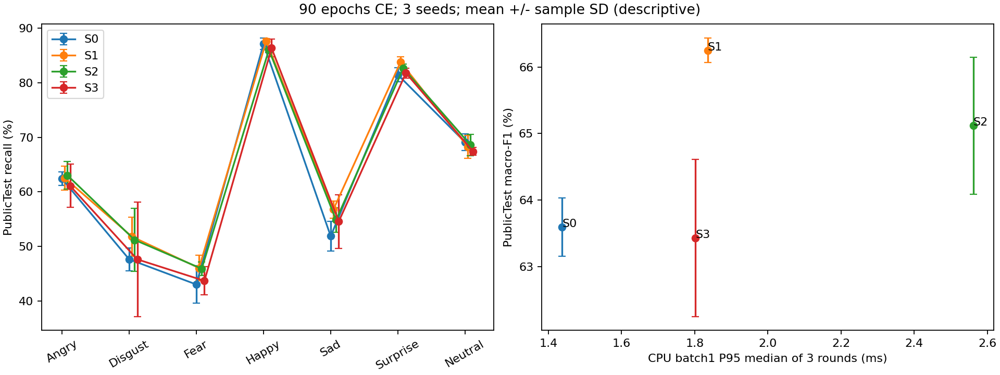
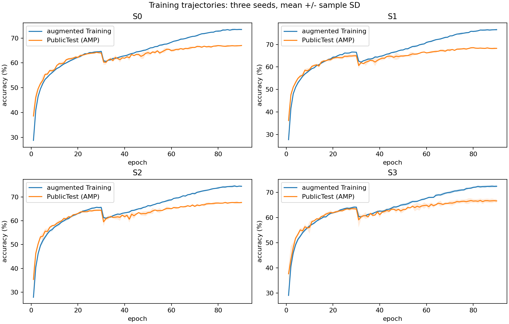
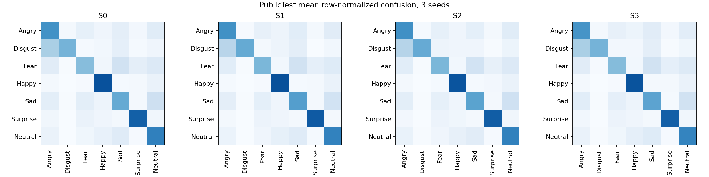

# MicroResNet结构对照结论

协议 `comparison-architecture-ce-v1`：12/12 run完整90轮，CE，seeds42/43/44。
三seed均值±样本标准差；百分数，std为百分点。

## PublicTest

| 臂 | accuracy | macro-F1 | balanced accuracy | Disgust recall |
|---|---:|---:|---:|---:|
| S0 | 67.07 ± 0.21 | 63.59 ± 0.44 | 63.22 ± 0.08 | 47.62 ± 2.06 |
| S1 | 68.71 ± 0.20 | 66.25 ± 0.19 | 65.25 ± 0.21 | 51.79 ± 3.57 |
| S2 | 67.93 ± 0.27 | 65.12 ± 1.03 | 64.60 ± 0.83 | 51.19 ± 5.74 |
| S3 | 67.04 ± 0.74 | 63.43 ± 1.18 | 63.21 ± 1.54 | 47.62 ± 10.46 |

## PrivateTest

| 臂 | accuracy | macro-F1 | balanced accuracy | Disgust recall |
|---|---:|---:|---:|---:|
| S0 | 68.38 ± 0.61 | 66.10 ± 0.51 | 66.07 ± 0.45 | 62.42 ± 2.78 |
| S1 | 69.17 ± 0.39 | 66.96 ± 0.62 | 67.04 ± 0.32 | 64.24 ± 1.05 |
| S2 | 68.61 ± 0.41 | 66.46 ± 0.60 | 66.80 ± 0.40 | 65.45 ± 1.82 |
| S3 | 68.10 ± 0.66 | 65.25 ± 0.28 | 65.51 ± 0.91 | 60.00 ± 3.64 |

## 预先固定门槛与成本

质量：Public宏F1至少+1个百分点、accuracy下降≤0.5个百分点、3/3配对seed均改善。
部署：参数≤1.6M、batch128无OOM、CPU P95≤同轮S0的1.5倍。质量与部署分别判定。

| 臂 | 宏F1差值(pp) | 三个seed差值(pp) | 质量通过 | 部署通过 | 参数 | CPU P95(ms) |
|---|---:|---|---|---|---:|---:|
| S0 | +0.00 | +0.00, +0.00, +0.00 | 基线 | 是 | 753,991 | 1.438 |
| S1 | +2.66 | +2.37, +3.37, +2.23 | 是 | 是 | 753,991 | 1.835 |
| S2 | +1.53 | +2.41, +1.06, +1.11 | 是 | 否 | 1,493,575 | 2.561 |
| S3 | -0.16 | -0.28, +1.48, -1.69 | 否 | 是 | 764,663 | 1.802 |

候选：**S1**；在PrivateTest前于2026-10-08T19:20:15.280540固定。
Private只作最终报告，没有据其调参或改变候选；此处候选不等于已更新推理演示权重。

## 无增强Training诊断

| 臂 | Training acc | Public acc | 差距(pp) |
|---|---:|---:|---:|
| S0 | 78.11 | 67.07 | 11.05 |
| S1 | 80.89 | 68.71 | 12.18 |
| S2 | 79.68 | 67.93 | 11.75 |
| S3 | 77.00 | 67.04 | 9.97 |

差距用于解释拟合/泛化；不能单独定位过拟合成因。S2同时增加深度与容量，不能归因于纯深度。
n=3为描述性比较，不宣称统计显著。官方划分像素重复仍存在，不宣称跨人员泛化。

完整七类统计、成本、更新数与来源指纹见[聚合摘要](aggregate_metrics.json)。
[方案](../../configs/plans/architecture_ce_v1.md)。原始预测、逐run记录、重复计时与权重仅保留本地。
