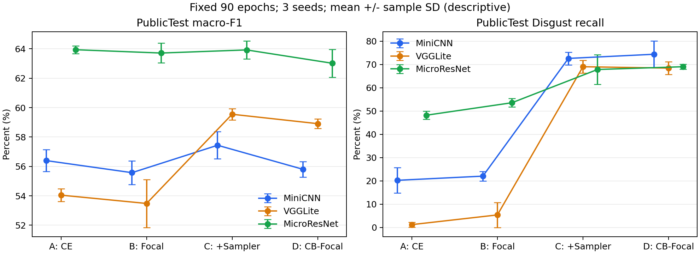

# 固定90轮A–D实验结论

状态：2026-10-07完成。协议 comparison-fixed-abcd-v3，36/36正式run完整90轮，全部准入。
A=CE/普通采样；B=Focal/普通采样；C=Focal/加权采样；D=CB-Focal/加权采样；类别专属增强关闭。

## PublicTest：预先指定的候选判断

三seed均值±样本标准差，单位百分数；std为百分点，n=3为描述统计。

| 模型 | 臂 | accuracy | macro-F1 | balanced accuracy | Disgust recall | 双条件门槛 |
|---|---|---:|---:|---:|---:|---|
| micro_resnet | A | 67.12 ± 0.22 | 63.94 ± 0.26 | 63.36 ± 0.30 | 48.21 ± 1.79 | CE基线 |
| micro_resnet | B | 66.70 ± 0.32 | 63.72 ± 0.67 | 63.62 ± 0.56 | 53.57 ± 1.79 | 未通过 |
| micro_resnet | C | 66.18 ± 0.41 | 63.93 ± 0.61 | 65.46 ± 0.84 | 67.86 ± 6.44 | 未通过 |
| micro_resnet | D | 65.24 ± 0.75 | 63.02 ± 0.95 | 64.89 ± 0.62 | 69.05 ± 1.03 | 未通过 |
| mini_cnn | A | 62.41 ± 0.29 | 56.39 ± 0.75 | 55.30 ± 0.65 | 20.24 ± 5.46 | CE基线 |
| mini_cnn | B | 61.45 ± 0.40 | 55.58 ± 0.81 | 54.43 ± 0.69 | 22.02 ± 2.06 | 未通过 |
| mini_cnn | C | 60.12 ± 0.75 | 57.44 ± 0.92 | 60.48 ± 0.98 | 72.62 ± 2.73 | 通过 |
| mini_cnn | D | 59.20 ± 0.08 | 55.80 ± 0.53 | 60.02 ± 0.84 | 74.40 ± 5.74 | 未通过 |
| vgg_lite | A | 64.34 ± 0.16 | 54.05 ± 0.43 | 54.31 ± 0.25 | 1.19 ± 1.03 | CE基线 |
| vgg_lite | B | 63.45 ± 0.52 | 53.48 ± 1.63 | 53.68 ± 0.97 | 5.36 ± 5.36 | 未通过 |
| vgg_lite | C | 62.11 ± 0.11 | 59.55 ± 0.38 | 61.13 ± 0.28 | 69.05 ± 2.73 | 通过 |
| vgg_lite | D | 61.89 ± 0.41 | 58.91 ± 0.32 | 61.21 ± 0.33 | 68.45 ± 2.73 | 通过 |

门槛：PublicTest平均Disgust recall>A，且macro-F1均值≥A；在PrivateTest评估前固定。
MiniCNN的C、VGGLite的C/D通过。它们提高少样本召回，但总体accuracy下降，不能称为全面提升。
MicroResNet的B/C/D均未通过；C与A的macro-F1均值仅差约-0.01个百分点，不足以断言C稳定劣于A。
A组MicroResNet在本轮的平均accuracy最高；各模型激活/Dropout不同，本轮不构成纯深度消融。

## PrivateTest：最终报告，未参与调参或候选选择

| 模型 | 臂 | accuracy | macro-F1 | balanced accuracy | Disgust recall |
|---|---|---:|---:|---:|---:|
| mini_cnn | A | 63.63 ± 0.48 | 56.52 ± 0.53 | 55.56 ± 0.39 | 16.36 ± 3.64 |
| mini_cnn | B | 62.22 ± 0.20 | 54.73 ± 0.42 | 53.99 ± 0.30 | 14.55 ± 0.00 |
| mini_cnn | C | 61.32 ± 0.81 | 58.91 ± 1.45 | 61.76 ± 1.22 | 75.76 ± 2.78 |
| mini_cnn | D | 60.56 ± 0.30 | 57.70 ± 0.29 | 61.74 ± 0.12 | 80.00 ± 1.82 |
| vgg_lite | A | 65.90 ± 0.34 | 54.73 ± 0.39 | 55.18 ± 0.38 | 0.00 ± 0.00 |
| vgg_lite | B | 64.19 ± 0.26 | 52.79 ± 0.59 | 53.67 ± 0.20 | 1.21 ± 2.10 |
| vgg_lite | C | 63.67 ± 0.58 | 62.13 ± 0.59 | 64.09 ± 0.58 | 80.61 ± 2.78 |
| vgg_lite | D | 63.45 ± 0.11 | 61.72 ± 0.49 | 64.73 ± 0.70 | 85.45 ± 4.81 |
| micro_resnet | A | 68.31 ± 0.40 | 66.22 ± 0.32 | 66.09 ± 0.50 | 63.03 ± 2.10 |
| micro_resnet | B | 67.59 ± 0.11 | 65.29 ± 0.29 | 65.71 ± 0.53 | 64.85 ± 4.20 |
| micro_resnet | C | 66.64 ± 0.92 | 65.18 ± 0.82 | 66.83 ± 0.89 | 76.97 ± 2.10 |
| micro_resnet | D | 66.35 ± 0.54 | 64.59 ± 0.68 | 66.63 ± 0.56 | 76.36 ± 1.82 |

## 完整性、来源与限制

全部best统一CPU float32/batch64评估PublicTest与PrivateTest各一次，72份各3589行预测；
accuracy/macro-F1/balanced accuracy及七类recall/support均由保存的标签和预测复算一致。
首组MiniCNN seed42因Windows监控读取干扰原子替换，在完整75轮last处续训到90轮；未重选run/seed。
历史训练与评估归档保留。官方跨划分像素重复仍存在，不宣称跨人员泛化。
小型、可提交的完整聚合指标与来源SHA见[aggregate_metrics.json](aggregate_metrics.json)。
可导出图见[PDF](public_comparison.pdf)。完整results.json、runs.csv、evaluations与checkpoint保留本地并忽略，
这些原始记录不随Git克隆提供；本轮没有删除、改写原始数据或重写Git历史。
后续[MicroResNet结构实验](../architecture_ce_v1/RESULTS.md)已完成12次完整90轮训练；
S1通过其预设质量与部署门槛，并已用于推理演示。两轮协议分别报告，不混合排名。
